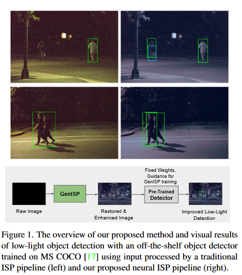
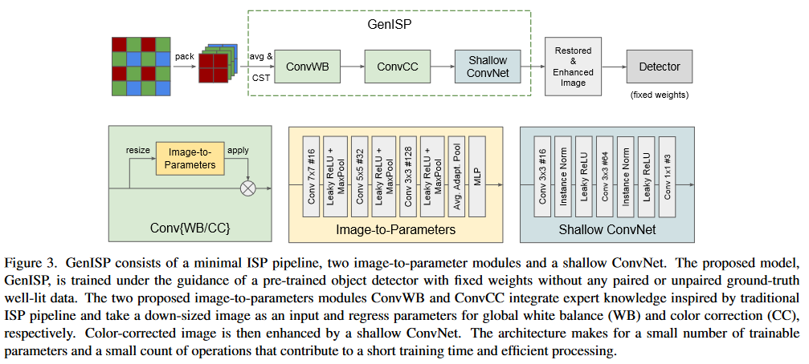
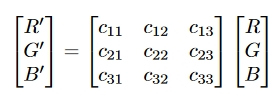
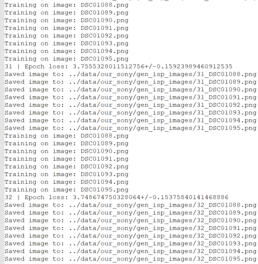

# Reproduction of GenISP: Generalizing Image Signal Processing for Low-Light Object Detection
## Reproduced by: Caspar Meijer, Taichi Uno & Davis Sterns

## Introduction

Object detection is a fundamental task in computer vision with many practical applications. Although the object detection has been considered practically solved, it remains challenging in low-light conditions [[1](#mpouziotas2022)].
To tacle these challenges, researchers have proposed fine-tuning detectors to use raw image data or using dedicated low-light neural pipelines trained on paired low- and normal-light data to restore and enhance images.

One such approach was proposed by Igor Morawski, Yu-An Chen, Yu-Sheng Lin, Shusil Dangi, Kai He, and Winston H. Hsu in their paper, "GenISP: Generalizing Image Signal Processing for Low-Light Object Detection" [[2](#morawski2022)]. The authors proposed a minimal neural ISP pipeline called GenISP that incorporates color space transformation to a device-independent color space and a two-stage color processing approach using image-to-parameter modules. They also trained the pipeline under the guidance of a pre-trained object detector and optimized it for machine cognition, rather than making assumptions about perceptual quality. 

In this report, we attempt to reproduce the training of GenISP network as explained by Morawski et al. and evaluate its effectiveness in improving object detection in low-light conditions. We follow their methodology and use a subset of their proposed dataset of 7K raw images. By reproducing this research, we aim to contribute to the ongoing efforts to improve object detection in low-light conditions and verify the reproducibility of Morawski et al.'s work. Additionally, we plan to discuss any limitations or drawbacks we encounter during our reproduction process, as well as suggest possible future improvements to the network architecture and training methodology.


## Data
We used the dataset provided by authors of GenISP: Generalizing Image Signal Processing for Low-Light Object Detection [[2](#morawski2022)]. The dataset consists of 7K raw images collected using two cameras, Sony RX100 (3.2K images) and Nikon D750 (4.0K), and bounding box annotations of people, bicycles and cars. The images have been taken in different low-light conditions: ranging from pitch dark to less challenging conditions with artificial lighting. The authors have made the dataset publicly available. See [RAW-NOD (Night Object Detection) Dataset](https://github.com/igor-morawski/RAW-NOD), the data can be accessed using [this link](https://docs.google.com/forms/d/1aIKTV6026daYFRtje7zcx4LeDz68AOcpWIH7XxNCICY/viewform?edit_requested=true).


### Data format
The images are provided in Raw file format. 
Raw image format is a type of file that contains unprocessed or minimally processed data from the image sensor of a digital camera. Unlike processed image formats like JPEG or PNG, which apply a fixed image signal processing (ISP) pipeline to the sensor data, raw files preserve the most information about the light intensity and color of the scene, at the best of the camera sensor’s performance. This allows for more flexibility and control in post-processing [[3](#adobeRaw)].

The authors chose to use RAW images because they argued that using raw image data would improve the robustness and accuracy of object detection in low-light conditions, compared to using processed image data from a traditional ISP pipeline. They also expected that using raw image data would avoid potential artifacts or distortions introduced by ISP processing.

### Our experience
We encountered some challenges in downloading the dataset from Google Drive, as it was a large zip archive (>70 GB) containing thousands of photos. When downloading the file using web browsers, the download always failed after around an hour. The authors did not provide any alternative way to access the dataset or any instructions on how to download it successfully. We had to find a workaround by installing the Google Drive application for Windows and saving the file as a shortcut in our personal Google Drive folders. This allowed us to open the zip archive without fully downloading it. We appreciate that the authors made the dataset publicly available, but we would suggest that they make it more accessible by splitting it into smaller files or hosting it on a different platform that supports large file transfers.

## Reproduction
<p float="left">
  
   
</p>


### Pre-processing
Preprocessing pipeline consists of two parts, namely packing and Color Space Transformation. 

The implementation of packing is shown as follows.
```python
raw_image = raw.raw_image.astype(np.int32)
packed_image = np.zeros((int(raw_image.shape[0] / 2), int(raw_image.shape[1] / 2), 4), dtype=np.int32)
packed_image[:, :, 0] = raw_image[0::2, 0::2]  # R Left top
packed_image[:, :, 1] = raw_image[0::2, 1::2]  # G Right top
packed_image[:, :, 2] = raw_image[1::2, 0::2]  # G Left bottom
packed_image[:, :, 3] = raw_image[1::2, 1::2]  # B Right bottom
```
The packing is carried out in the way that a pixel of the packed image is a vector of four elements which are the four square neighbouring pixels of the original raw image. After packing, the two green channels are averaged and returned as an RGB image.

After that the paper mentions the averaging of the green channels, this is done as followed:
```python
averaged_image = np.zeros((packed_image.shape[0], packed_image.shape[1], 3), dtype=np.int32)
averaged_image[:, :, 0] = packed_image[:, :, 0]  # R
averaged_image[:, :, 1] = (packed_image[:, :, 1] + packed_image[:, :, 2]) / 2  # G
averaged_image[:, :, 2] = packed_image[:, :, 3]  # B
```

Colour Space Transformation is to convert images' colour space into device independent using the matrix specific to the device. The matrix can be found as one of the fields of a raw object after loading an image. By doing this, the model achieves a higher level of generalizability. The color-space-transformation matrix is present in the raw image file `raw.rgb_xyz_matrix[0:3, :]`

The color-space-transformation can then be multiplied with the average image like so `xyz_image = averaged_image @ conversion_matrix.T` with as a result the image in XYZ color space.
Although we implemented this part in the beginning, the reproduction was not an easy task due to its poor explanation, especially image packing, which took us some time to figure out how it works. Furthermore, the output values of the image were not between 0 and 1, this it was very difficult to display these images. Therefore we decided to use the RawPy build in the function of "rawpy.postprocess" instead of this preprocessing pipeline, which also results in a device independent color-space (PNG). 

#### GEN-ISP
The main body of Gen ISP consists of mainly three components, ConvWB, ConvCC and Shallow ConvNet, as shown in the image above.

ConvWB is implemented to adjust global illumination levels and white balance of the image, while ConvCC is to map the colour space so that is optimal for a shallow ConvNet at the end of the entire pipeline. The image is resized and passed to Image-to-Parameter modules, while are three convolutions of tensors with different sizes with Leaky Rectified Linear Unit and Max pooling in between and followed by adaptive averaging pooling and MLP at the end. 

##### ConvWB
<p float="left">
  
</p>
The ConvWB is applied first to the resized images.

##### ConvCC
<p float="left">
   
</p>
The ConvCC is applied secondly to the resized images.

After ConvWB and ConvCC, it is passed to a non-linear image enhancement by a shallow ConvNet, which are also a sequence of two convolutions, where there are Instance normalizations and a Leaky Rectified Linear Unit in between.

At the end, the entire pipeline are implemented as below. 

```python
class GenISP(th.nn.Module):

    def __init__(self):
        super().__init__()
        # minimal pre-processing pipeline packing and color space transformation

        # 2-step color processing stage realized by image-to-parameter modules: ConvWB and ConvCC
        self.image_to_parameter = th.nn.Sequential(
            th.nn.Conv2d(3, 16, kernel_size=7, padding=3), th.nn.LeakyReLU(), th.nn.MaxPool2d(kernel_size=2),
            th.nn.Conv2d(16, 32, kernel_size=5, padding=2), th.nn.LeakyReLU(), th.nn.MaxPool2d(kernel_size=2),
            th.nn.Conv2d(32, 128, kernel_size=3, padding=1), th.nn.LeakyReLU(), th.nn.MaxPool2d(kernel_size=2),
            th.nn.AdaptiveAvgPool2d(1),
            th.nn.Flatten(1),
        )

        self.conv_wb = th.nn.Sequential(
            Resize((256, 256)),
            deepcopy(self.image_to_parameter),
            th.nn.Linear(128, 3),
            Diagonalize(),
        )

        self.conv_cc = th.nn.Sequential(
            Resize((256, 256)),
            deepcopy(self.image_to_parameter),
            th.nn.Linear(128, 9),
            th.nn.Unflatten(1, (3, 3))
        )

        # A non-linear local image enhancement by a shallow ConvNet
        self.shallow_conv_net = th.nn.Sequential(th.nn.Conv2d(3, 16, kernel_size=3, padding=1), th.nn.InstanceNorm2d(16), th.nn.LeakyReLU(),
                                                 th.nn.Conv2d(16, 64, kernel_size=3, padding=1), th.nn.InstanceNorm2d(64), th.nn.LeakyReLU(),
                                                 th.nn.Conv2d(64, 3, kernel_size=1))

        self.optimizer = th.optim.Adam(self.parameters(), lr=1e-2)

    def forward(self, batch):
        """
        :param batch: batch of images
        :return: enhanced images
        """
        output = []
        for image in batch:
            wb_matrix = self.conv_wb(image)
            image = th.matmul(image.permute(0, 2, 3, 1), wb_matrix).permute(0, 3, 1, 2)
            cc_matrix = self.conv_cc(image)
            image = th.matmul(image.permute(0, 2, 3, 1), cc_matrix).permute(0, 3, 1, 2)
            x = self.shallow_conv_net(image)
            output.append(x.squeeze(0))
        return output
```
Source: https://github.com/Capsar/2022_Q3---DL-GenISP/blob/main/group52/gen_isp.py

Regarding the reproducibility of this module, the explanation of ConvWB and ConvCC was confusing as the only place where it shows the flow of the pipeline was Figure 3 (the image above). An explanation of the flow should have taken place in the paragraph body and how these modules were integrated into the entire pipeline.   
### Training
In order to train, we have used RetinaNet model available [Here](https://github.com/pytorch/vision/blob/main/torchvision/models/detection/retinanet.py). This models will be compared with the output of the current network and calculate losses.

As for the loss functions, the paper defined loss as the sum of classification error and regression error. The classification error is implemented by alpha-balanced focal loss wheras the regression loss is by smooth-L1 loss. Both of the implemetations were already there within the RetinaNet model, thus we reused them to compute the losses. 

The training process is implemented differently as mentioned in the paper because of hardware limitations.
For us, It was only possible to load 2 downsized images in memory at a time. Thus, we had to train the model in batches of 2 images. The training process is implemented as follows:
The hyperparameters that were used were: `batch_size=2`, `epochs=200`, `resize=(1333, 800)`, `random_seed=42`, `learing_rate=1e-2`. The resize is the same as in the paper. The learning rate in the paper does down after a couple of epochs, in our experiment it is fixed.

The following code can be found back in [main.py](https://github.com/Capsar/2022_Q3---DL-GenISP/blob/main/group52/main.py).

#### Load hyperparameters and initialize GenISP & Object Detector Model
```python
    h_parameters = get_hyper_parameters()

    gen_isp = GenISP()

    # Load the model https://github.com/pytorch/vision/blob/main/torchvision/models/detection/retinanet.py
    object_detector = torchvision.models.detection.retinanet_resnet50_fpn_v2(weights=RetinaNet_ResNet50_FPN_V2_Weights.COCO_V1)
    # We do not want to train the object detector so set requires_grad to false for all parameters.
    for param in object_detector.parameters():
        param.requires_grad = False
    th.save(object_detector, '../data/retinanet_v2_object_detector.pickle')
```
#### Load the data and annotations and convert to a tensor for PyTorch usage.
The `load_annotations` & `annotations_to_tensor` function can be found in [gen_isp.py](https://github.com/Capsar/2022_Q3---DL-GenISP/blob/main/group52/gen_isp.py)
```python
    data_dir = '../data/our_sony/'
    # load_label
    targets_per_image = load_annotations(data_dir + 'raw_new_train.json')
    targets_per_image = load_annotations(data_dir + 'raw_new_test.json', targets_per_image)
    targets_per_image = load_annotations(data_dir + 'raw_new_val.json', targets_per_image)
    targets_per_image = annotations_to_tensor(targets_per_image)

    raw_images_dir = data_dir + 'raw_images/' # Containing the .ARW files.
    processed_images_dir = data_dir + 'processed_images/' # Containing the .PNG files outputted by RawPy.
    gen_isp_images_dir = data_dir + 'gen_isp_images/' # Containing the .PNG files outputted by GenISP. (Intermediate results)
```
#### Post-process the images using RawPy post-processing.
This is the same code that is used in the [export_postpocessed_images.py](https://github.com/Capsar/2022_Q3---DL-GenISP/blob/main/group52/export_postprocessed_images.py).
The `auto_post_process_image` function can be found in [image_helper.py](https://github.com/Capsar/2022_Q3---DL-GenISP/blob/main/group52/image_helper.py).

```python
    if postprocess_images:
        images_paths = os.listdir(raw_images_dir)
        for p in images_paths:
            image_id = p.split('.')[0]
            # image = (load_image(raw_images_dir + p)*255).astype(np.uint8) # This post-processing did not result in good images.
            image = auto_post_process_image(raw_images_dir + p)
            Image.fromarray(image).resize(h_parameters['resize']).save(processed_images_dir + image_id + '.png', format='png')
            print(f'Saved image to: {processed_images_dir + image_id + ".png"}')
```

#### Main train loop, for each epoch we train the model on all images.
This is the most beefy loop in our reproduction project so we will explain it in detail.

In this deep learning training loop, the following steps are performed:
1. The list of image paths is created by reading the contents of the ``processed_images_dir`` directory.
2. The training loop iterates over the specified number of epochs.
3. For each epoch, an empty list called ``epoch_loss`` is initialized to store the loss values for the current epoch. Two empty lists ``batch_inputs`` and ``batch_targets`` are also initialized to store the input images and target labels for each batch.
4. The loop iterates over all images in the ``processed_images_dir`` directory, loading and converting each image to a tensor, and appending it to the ``batch_inputs`` list. The corresponding targets for each image are also appended to the ``batch_targets`` list.
5. When the number of images in ``batch_inputs`` is equal to the specified batch size, the training loop proceeds to train the GenISP model and ObjectDetector. First, the images are passed through the GenISP model, and the generated outputs are fed into the ObjectDetector.
6. The ObjectDetector computes the classification and bounding box regression losses during training.
7. The GenISP model's optimizer's gradients are zeroed, and then the total loss is calculated by summing up the classification and bounding box regression losses.
8. The total loss is backpropagated through the GenISP model, and the optimizer updates the model's parameters.
9. The total loss for the current batch is appended to the ``epoch_loss`` list, and the ``batch_inputs`` and ``batch_targets`` lists are reset for the next batch.
10. After processing all images in the current epoch, the mean and standard deviation of the ``epoch_loss`` list are calculated and printed.
11. The loop then saves the GenISP outputs for each image after each epoch. For each image, it is loaded and converted to a tensor again, passed through the GenISP model, and the output is converted back to a NumPy array and saved as a PNG image in the ``gen_isp_images_dir`` directory.
12. The loop prints the path where the image has been saved. 

This training loop continues for the specified number of epochs, iterating over all images and updating the GenISP model's parameters using the ObjectDetector's losses.
```python
    images_paths = os.listdir(processed_images_dir) # 1
    for epoch in range(h_parameters['epochs']): # 2
        epoch_loss = [] # 3
        batch_inputs, batch_targets = [], [] # 3
        # Looping over all images in the processed image directory.
        for i, p in enumerate(images_paths): # 4 
            print('Training on image:', p)
            image_id = p.split('.')[0]
            targets = targets_per_image[image_id]
            # Load the image and convert it to a tensor.
            image_np_array = cv2.imread(os.path.join(processed_images_dir, p))
            image_tensor = th.from_numpy(image_np_array).unsqueeze(0).permute(0, 3, 1, 2).div(255.0)

            # Add the image and targets to the batch.
            batch_inputs.append(image_tensor)
            batch_targets.append(targets)

            # If we have a full batch, train the model
            if len(batch_inputs) % h_parameters['batch_size'] == 0:
                # Pull the images trough the GenISP model and ObjectDetector.
                gen_isp_outputs = gen_isp(batch_inputs)

                # The Object Detector we used outputs the losses in training mode. These are classification + regression loss.
                object_detector_losses = object_detector(gen_isp_outputs, batch_targets)

                # Only a training step is performed on the GenISP model.
                gen_isp.optimizer.zero_grad()

                # Classification loss + Bounding box regression loss.
                total_loss = object_detector_losses['classification'] + object_detector_losses['bbox_regression']
                total_loss.backward()
                gen_isp.optimizer.step()
                epoch_loss.append(total_loss.item())
                batch_inputs, batch_targets = [], [] # Reset the batch.

        # Print the loss for the epoch after having looped over all images.
        print(f'{epoch} | Epoch loss: {np.mean(epoch_loss)}+/-{np.std(epoch_loss)}')

        # Save the gen_isp outputs after each epoch.
        for p in images_paths:
            image_id = f'{epoch}_{p.split(".")[0]}'
            image_np_array = cv2.imread(os.path.join(processed_images_dir, p))
            image_tensor = th.from_numpy(image_np_array).unsqueeze(0).permute(0, 3, 1, 2).div(255.0)
            with th.no_grad():
                gen_isp_outputs = gen_isp([image_tensor])
            gen_isp_array = (gen_isp_outputs[0].permute(1, 2, 0).numpy() * 255).astype(np.uint8)
            Image.fromarray(gen_isp_array).save(gen_isp_images_dir + image_id + '.png', format='png')
            print(f'Saved image to: {gen_isp_images_dir + image_id + ".png"}')
```

### Results
By running the code in [main.py](https://github.com/Capsar/2022_Q3---DL-GenISP/blob/main/group52/main.py) the following results were obtained.
They can be found in the [data/results](https://github.com/Capsar/2022_Q3---DL-GenISP/tree/main/data/results) folder.

On the left we can see the logs of the training loop at epochs 31 and 32, the training started at a loss of `4.05` and ended at epoch 32 with a loss of `3.75`. This is a good indication that the model is learning the parameters in the GenISP model.

On the right we can see a glimpse of the outputted images of GenISP, the images are resized to, the in the paper mentioned `1333x800` pixels. As we can see the colors are changing, indicating that the parameters in GenISP are updated.
<p float="left">
   
  
</p>

## Conclusions

This project aimed to reproduce the GenISP neural ISP pipeline for low-light object detection, a novel method proposed by Morawski et al. Our team implemented all the necessary components of the pipeline, including image packing and the integration of ConvWB and ConvCC modules, which were not clearly explained in the original paper.

Our experiments showed a consistent decrease in loss throughout the training process, indicating that the model was learning and the GenISP pipeline was effectively adapting to object recognition in dark. We reduced the training batch size due to hardware limitations, but we believe that this did not affect our results.

Our reproduction confirms the feasibility of the GenISP pipeline, and provides a clear and detailed implementation that can be used by other researchers interested in this topic.
With our results we cannot verify that the GenISP method is better than other low-light image
restoration techniques nor that it can generalize
to unseen sensors and object detectors. However, we expect that running our code on better hardware would fully reproduce the results of the original paper.

## References

<a id="mpouziotas2022">[1]</a> D. Mpouziotas, E. Mastrapas, N. Dimokas, P. Karvelis and E. Glavas, "Object Detection for Low Light Images," 2022 7th South-East Europe Design Automation, Computer Engineering, Computer Networks and Social Media Conference (SEEDA-CECNSM), Ioannina, Greece, 2022, pp. 1-6, doi: 10.1109/SEEDA-CECNSM57760.2022.9932921.


<a id="morawski2022">[2]</a> I. Morawski, Y. -A. Chen, Y. -S. Lin, S. Dangi, K. He and W. H. Hsu, "GenISP: Neural ISP for Low-Light Machine Cognition," 2022 IEEE/CVF Conference on Computer Vision and Pattern Recognition Workshops (CVPRW), New Orleans, LA, USA, 2022, pp. 629-638, doi: 10.1109/CVPRW56347.2022.00078.

<a id="adobeRaw">[3]</a> Adobe. (n.d.). What is a RAW file and how do you open it? https://www.adobe.com/creativecloud/file-types/image/raw.html

## Who did what
| Who           | What                                                                                                                                                                                                                                                      |
| ------------- | --------------------------------------------------------------------------------------------------------------------------------------------------------------------------------------------------------------------------------------------------------- |
| Caspar Meijer | Implemented GenISP Pytorch Model in gen_isp.py, Setup main.py with training loop, created visualize_single_image.py & export_post_processed_image.py, image_helper.py, retinanet_helper.py. In Blog: Training, Pre-processing finishing touches, Results. |
| Taichi Uno    | Helped with main.py, setup loss function first try, worked in image_helper.py on load image packing & averaging pixels, loading images, worked on comments & in blog: data, pre-processing, GENISP                                                        |
| Davis Sterns  | Extracted Hyperparameters from paper, setup outline for loss functions, In Blog: conclusions, references, introduction, added bits to data                                                                                                                |              |                                                                                                                                                                                                                                                           |

In depth contributions can be found in github commits. (During lab we worked together in 1 commit.)
